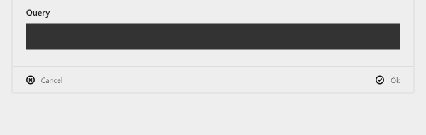

# Query Field

A Kirby 3 field plugin to edit KQL Queries

> This plugin is completely free and published under the MIT license. However, if you are using it in a commercial project and want to help me keep up with maintenance, please consider [buying me caffeine](https://buymeacoff.ee/zLFxgCHlG) or purchasing your license(s) through my [affiliate link](https://a.paddle.com/v2/click/1129/36164?link=1170).



## Installation

### Download

Download and copy a release (from the release tab) to `/site/plugins/k3-query-field`.

### Git submodule

```
git submodule add https://github.com/rasteiner-dist/k3-query-field.git site/plugins/k3-query-field
```

### Composer

```
composer require rasteiner/k3-query-field
```

## Example

In the blueprint:

```yaml
fields:
  myQuery:
    type: query
    label: My Query

```

Run a query in a template:
```php
<?php for($page->myQuery()->executeQuery(compact('kirby', 'site', 'page')) as $item): ?>
  <?= $item->title() ?>
<?php endforeach ?>

```

## License

MIT

## Credits

- [Roman Steiner](https://github.com/rasteiner) (Author)
- [dmitrysoshnikov](https://github.com/dmitrysoshnikov)] (for his excellent parser generator tool)
